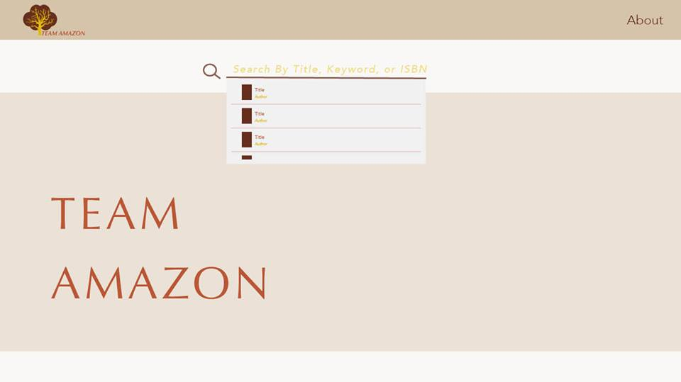
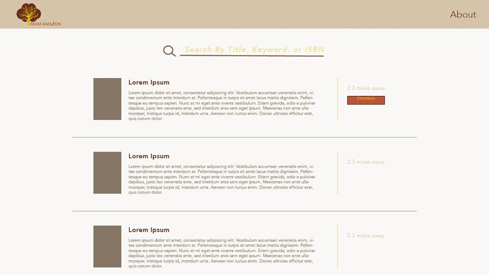
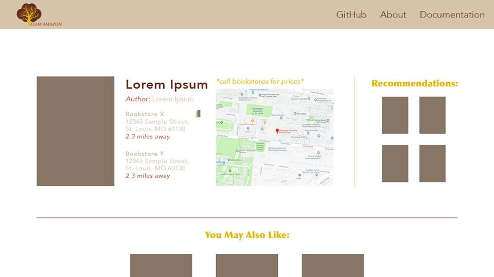

<!--
links to example:
https://github.com/apache/incubator-superset/blob/master/README.md

-->
<!--
MIT License

Copyright (c) 2018

Permission is hereby granted, free of charge, to any person obtaining a copy
of this software and associated documentation files (the "Software"), to deal
in the Software without restriction, including without limitation the rights
to use, copy, modify, merge, publish, distribute, sublicense, and/or sell
copies of the Software, and to permit persons to whom the Software is
furnished to do so, subject to the following conditions:

The above copyright notice and this permission notice shall be included in all
copies or substantial portions of the Software.

THE SOFTWARE IS PROVIDED "AS IS", WITHOUT WARRANTY OF ANY KIND, EXPRESS OR
IMPLIED, INCLUDING BUT NOT LIMITED TO THE WARRANTIES OF MERCHANTABILITY,
FITNESS FOR A PARTICULAR PURPOSE AND NONINFRINGEMENT. IN NO EVENT SHALL THE
AUTHORS OR COPYRIGHT HOLDERS BE LIABLE FOR ANY CLAIM, DAMAGES OR OTHER
LIABILITY, WHETHER IN AN ACTION OF CONTRACT, TORT OR OTHERWISE, ARISING FROM,
OUT OF OR IN CONNECTION WITH THE SOFTWARE OR THE USE OR OTHER DEALINGS IN THE
SOFTWARE.-->

# [Team Amazon](http://ec2-13-59-74-236.us-east-2.compute.amazonaws.com/new_frontend/workingsitefileswithphp/index.php)

<!-- Button that links to our website-->

**Team Amazon** is a web application for finding books in the St. Louis area.

## Screenshots

**Search For Books**

**View Search Results**

**View Stores that have a certain book in stock**

## Team Amazon Book Finder

Team Amazon Book finder provides:

- An easy to navigate website that lets users search for books at the stores and libraries.
- A map that visualizes the distance between the user and the providers with their book of choice
- Recommendations for other books based on the book that the user is looking at.

## Cambridge Analytica Integration

- Team Amazon's search and recommendation algorithms are powered by the Cambridge Analytica API

## Google Maps Integration

- The map visualization on the book detail page is powered by the Google Maps API

## Resources

\*[Slides from product announcement](https://drive.google.com/file/d/1sfGm8OYDoZwespeqlPC3RSoLVp3tziZj/view?usp=sharing)

\*[Slides from beta release presentation](https://drive.google.com/file/d/1CEPaFG4mx-Dp-ZrIQHSto34NAnBoChoT/view?usp=sharing)

<!-- slides from mvp -->

## Bookstores and Libraries featured in Team Amazon Book Finder

<!--  -->

- Washington University Campus Store
- Fontbonne Bookstore
- Subterranean Books
- Left Bank Books
- The Wizards Wagon
